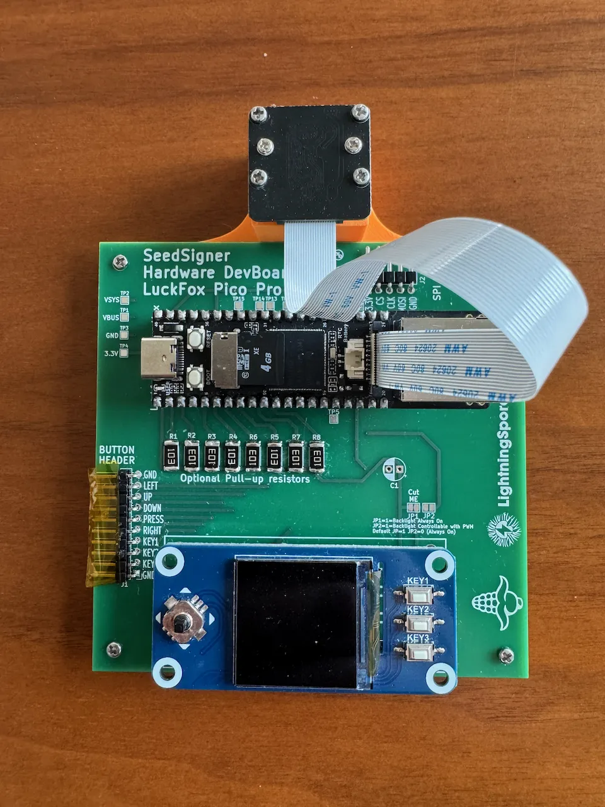
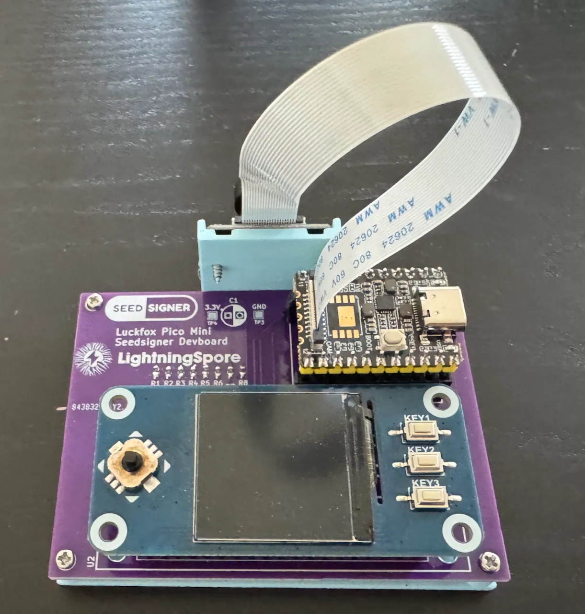
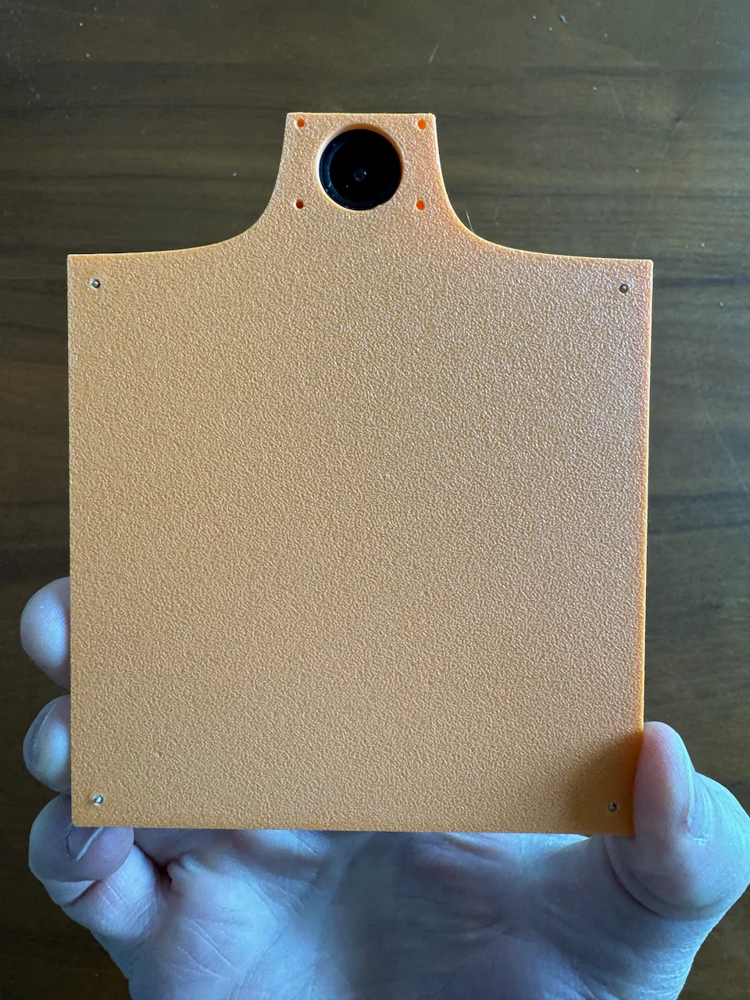
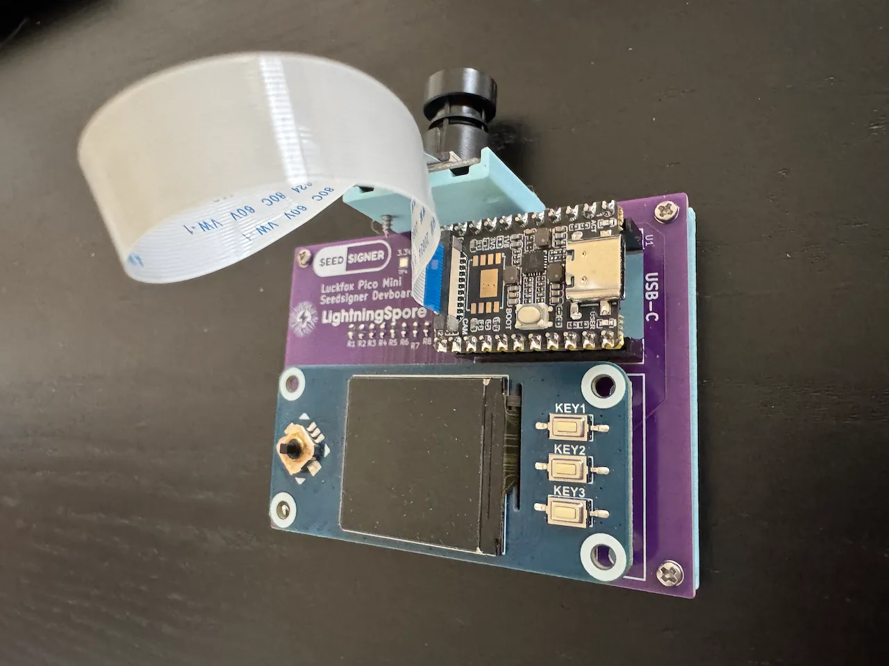
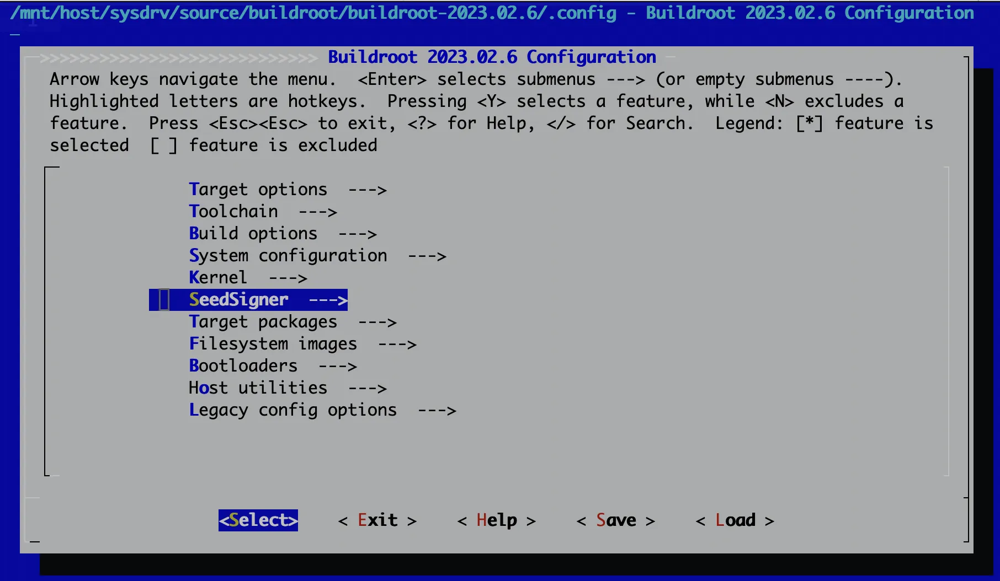
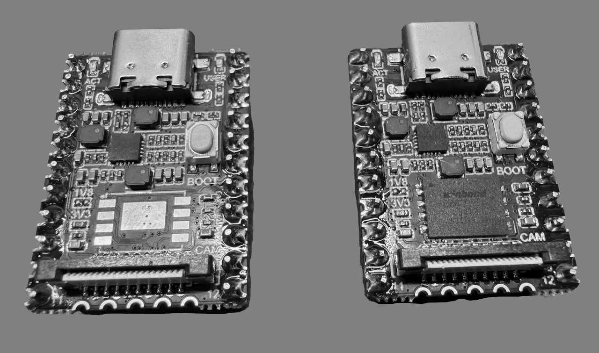

# seedsigner-luckfox-pico
Port of the SeedSigner code to the LuckFox Pico Pro/Max embedded ARM(ricv?) linux board

## Demo Videos

### First Look: Seedsigner running on Luckfox Pico linux devboard
[](https://www.youtube.com/watch?v=WHkOSn-lPG4)

## Support the Developer
If you find this project helpful and would like to support its development, you can buy me a coffee! Your support helps keep this project going and funds future improvements. Help decentralize Bitcoin hardware!

[](https://www.buymeacoffee.com/lightningspore)

## Hardware Photos







## Materials Needed
Check out the shopping list for a parts list of various Luckfox-based hardware configurations: [here](docs/shopping_list.md)


## OS Image Build With Buildroot
The OS image is built using Buildroot in a Docker container. The complete build process is documented in [OS-build-instructions.md](buildroot/OS-build-instructions.md).



For detailed build instructions, package requirements, and troubleshooting, see [OS-build-instructions.md](buildroot/OS-build-instructions.md).

## Dev machine setup

### Install ADB
Developing for the Luckfox Pico device is quite convenient since the devices never connect to the internet and you can access the device shell using `adb`. You can push files back and forth to your dev machine, and you can access the device as a shell easily.
```
# mac
brew install homebrew/cask/android-platform-tools

# linux
sudo apt install android-tools-adb
```

### ADB Connection and Device Management

1. Connect to the device:
```
# List connected devices
adb devices

# Connect to device shell
adb shell

# Check device info
adb shell uname -a
adb shell cat /proc/version
```

2. File Operations:
```
# Push files to device
adb push local_file.txt /remote/path/

# Pull files from device
adb pull /remote/path/file.txt .

# List files on device
adb shell ls /path/to/directory
```

## Hardware Identification
Notice the left device has an empty PCB footprint pattern on it. This is where the optional SPI flash is soldered on to. For the SeedSigner project we don't want permanent storage, so avoid devices with soldered on SPI flash.

```
Luckfox Pico Mini A -> No Flash
Luckfox Pico Mini B -> Soldered Flash
```



## Flashing the Device

### Flash MicroSD Card
```
sudo dd bs=4M status=progress if=/path/to/update.img of=/dev/diskX
```
Replace `/dev/diskX` with your actual SD card device path.


## Luckfox Pico OS Modifications
We have forked the [Luckfox Pico SDK](https://github.com/lightningspore/luckfox-pico) in order to enable various hardware features like pull-up resistors, adjust video RAM, and other things.

### Camera Memory
The Luckfox devotes some of its memory for camera related algorithms, but we don't use this feature. Particularly on the Luckfox Pico Mini device, which only has 64MB of RAM, it is beneficial for us to reclaim a bit of this memory.

Memory usage WITHOUT modification:
```bash
[root@luckfox ]# free -h
              total        used        free      shared  buff/cache   available
Mem:          33.0M       24.3M        1.4M      476.0K        7.3M        5.4M
Swap:             0           0           0
```

Memory usage WITH modification:
```bash
[root@luckfox ]# free -h
              total        used        free      shared  buff/cache   available
Mem:          53.0M       23.6M        1.9M      472.0K       27.5M       25.3M
Swap:             0           0           0
```

### Pull-up Resistors
Our current dev board has external pull-up resistors, since we didn't know how to enable these at the time, and it is always smart to plan ahead when designing PCBs. NOTE: Even with this commit with this change, the internal pull-ups don't seem to work.

### SPI Buffer Size
While it is possible to send SPI data in chunks, you are able to increase the SPI buffer size to slightly increase throughput, which is useful for larger displays.

### PWM Output
In order to control the LCD screen backlight and support true dimming of the display (instead of just changing the background color of the QR code, for example), we had to enable a PWM on a specific output pin.