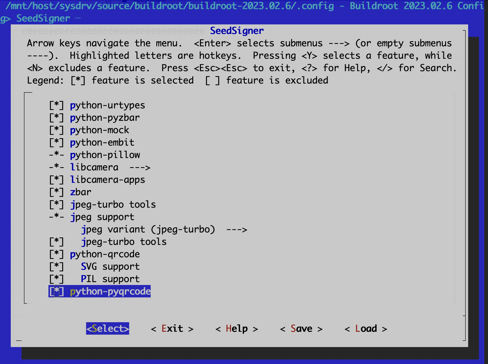

# OS Build Instructions

## Setup the Docker build environment
Run these commands from `buildroot` directory.

Build the builder image:
```bash
cd buildroot/
docker build -t foxbuilder:latest .
```

*IMPORTANT* We need all of these directories to be setup, and cloned in our `$HOME` directory:
```bash
ls ~
luckfox-pico  seedsigner  seedsigner-luckfox-pico  seedsigner-os
```
The `seedsigner-luckfox-pico` directory is this repo we are already in!


Clone the Luckfox SDK repo:
```bash
git clone https://github.com/lightningspore/luckfox-pico.git \
    --depth=1 --single-branch
```

Clone the Seedsigner OS repo:
```bash
git clone https://github.com/seedsigner/seedsigner-os.git \
    --depth=1 --single-branch
```

Clone the Seedsigner repo:
```bash
git clone https://github.com/lightningspore/seedsigner.git \
    --depth=1 -b luckfox-dev --single-branch
```


## Run OS Build

Run these commands from `buildroot/` directory. This is the directory/repo we cloned above.

```bash
LUCKFOX_SDK_DIR=$HOME/luckfox-pico
SEEDSIGNER_CODE_DIR=$HOME/seedsigner
LUCKFOX_BOARD_CFG_DIR=$HOME/seedsigner-luckfox-pico
SEEDSIGNER_OS_DIR=$HOME/seedsigner-os

# TODO check all these above paths exist

docker run -d --name luckfox-builder \
    -v $LUCKFOX_SDK_DIR:/mnt/host \
    -v $SEEDSIGNER_CODE_DIR:/mnt/ss \
    -v $LUCKFOX_BOARD_CFG_DIR:/mnt/cfg \
    -v $SEEDSIGNER_OS_DIR:/mnt/ssos \
    foxbuilder:latest
```

These below commands are run INSIDE of the docker image.

Enter the container:
```bash
docker exec -it luckfox-builder bash
```

Start the build:
```bash
/mnt/cfg/buildroot/add_package_buildroot.sh
```


This commands sets the build targets:
Select, Pico Pro Max, buildroot, and SPI.
```bash
# set build configuration
./build.sh lunch
```

This command allows us to choose what packages to install into our OS image.
```bash
# configure packages to install in buildroot
./build.sh buildrootconfig
```




After selecting all the above packages, SAVE the configuration.
The configuration is saved at: `sysdrv/source/buildroot/buildroot-2023.02.6/.config`

You can sanity check your configuration to ensure the selected packages have been enabled like so:
```bash
cat sysdrv/source/buildroot/buildroot-2023.02.6/.config | grep "LIBCAMERA"
cat sysdrv/source/buildroot/buildroot-2023.02.6/.config | grep "ZBAR"
cat sysdrv/source/buildroot/buildroot-2023.02.6/.config | grep "LIBJPEG"
...
```

A final sanity check, this shows all enabled packages... This might be useful as we try and remove any unnecessary packages from the build:
```bash
cat sysdrv/source/buildroot/buildroot-2023.02.6/.config | grep -v "^#"
```

### Adding Custom Packages
If you need to add custom packages to the buildroot configuration, you can use the `add_package_buildroot.sh` script. This script:
1. Adds SeedSigner-specific packages to the buildroot configuration
2. Copies necessary package files from the seedsigner-os repository
3. Updates Python paths and configurations
4. Adds required dependencies like python-pyzbar, python-embit, and camera-related packages

To use the script:
```bash
# From the buildroot directory
./add_package_buildroot.sh
```

This command will use one of the saved configurations for the build:
```bash
# Use config from repo
cp ../configs/config_20241218184332.config sysdrv/source/buildroot/buildroot-2023.02.6/.config

# Sanity check the configuration was loaded properly
# Selected packages like ZBAR should be listed as enabled here
./build.sh buildrootconfig
```

Start the image compilation process:
```bash
./build.sh uboot
./build.sh kernel
./build.sh rootfs
# needed for camera libs
./build.sh media
```

Verify all of the .img files are there:
```bash
$ ls /mnt/host/output/out/           
S20linkmount  media_out  rootfs_uclibc_rv1106  sysdrv_out

$ ls /mnt/host/output/image/
boot.img  download.bin  idblock.img  uboot.img
```

Copy over app code and pin configs
```bash
# Pin configs
cp /mnt/cfg/config/luckfox.cfg /mnt/host/output/out/rootfs_uclibc_rv1106/etc/luckfox.cfg

# Seedsigner code
cp -r /mnt/ss/src/ /mnt/host/output/out/rootfs_uclibc_rv1106/seedsigner
```

Package:
```bash
# Package up the pieces
./build.sh firmware
```

Double check the output, now all of the expected .img files are there:
```bash
$ ls /mnt/host/output/image/
boot.img  download.bin  env.img  idblock.img  oem.img  rootfs.img  sd_update.txt  tftp_update.txt  uboot.img  update.img  userdata.img
```

Final Piece of Sanity Checking:
```bash
dbg='yes' ./tools/linux/Linux_Upgrade_Tool/rkdownload.sh -d output/image/
```

Package into single flashable ISO image:
```bash
cd /mnt/host/output/image
/mnt/cfg/buildroot/blkenvflash seedsigner-luckfox-pico.img
```

Send back to dev machine (if building on a remote X86 machine):
```bash
scp ubuntu@11.22.33.44:/home/ubuntu/seedsigner-luckfox-pico/buildroot/luckfox-pico/output/image/seedsigner-luckfox-pico.img ~/Downloads
```

Flash to MicroSD Card:
```bash
sudo dd bs=4M \
    status=progress \
    if=/Users/lightningspore/Downloads/seedsigner-luckfox-pico.img \
    of=/dev/disk8
```

Put MicroSD Card into Luckfox Pico Device.

```bash
adb shell
```

TODO: Link to next steup in the install/setup process

## Official resources

[Luckfox Pico Official Flashing Guide](https://wiki.luckfox.com/Luckfox-Pico/Linux-MacOS-Burn-Image/) - Official documentation for flashing images to the Luckfox Pico device on Linux and macOS systems


## Hardware Device Overlay Config
```
cat luckfox-pico/sysdrv/source/kernel/arch/arm/boot/dts/rv1103g-luckfox-pico.dts
cat luckfox-pico/sysdrv/source/kernel/arch/arm/boot/dts/rv1103.dtsi
cat luckfox-pico/sysdrv/source/kernel/arch/arm/boot/dts/rv1103-luckfox-pico-ipc.dtsi
cat luckfox-pico/sysdrv/source/kernel/arch/arm/boot/dts/rv1106-evb.dtsi
```