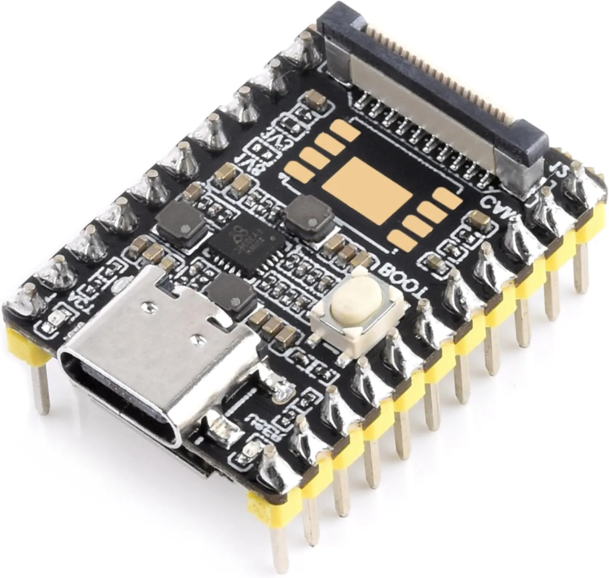
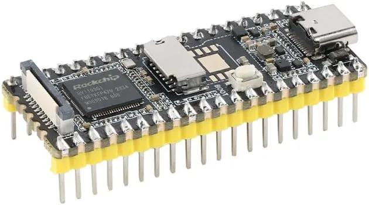
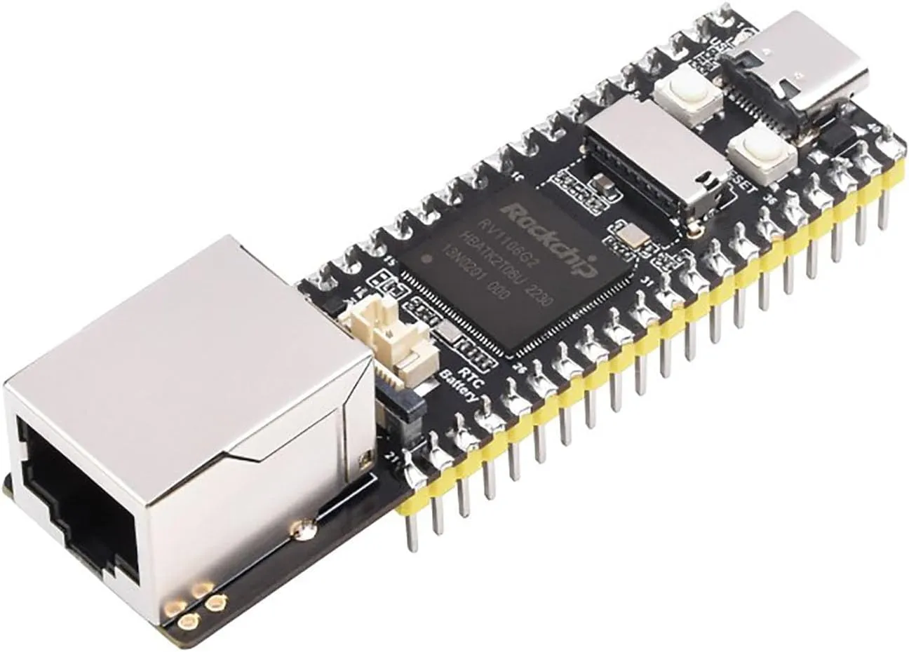

# SeedSigner LuckFox Pico Shopping List

This document contains all the materials needed to build your own SeedSigner using the LuckFox Pico Pro/Max development board.

## Hardware Components
There are multiple PCB revisions available in this repository, some which support the Luckfox Pico Pro Max, with its two rows of 20 pins, and some designs supports the Luckfox Pico Mini, with its two rows of 11 pins.

Small form factor, no SPI flash:

Larger form factor, no SPI flash:

Larger form factor, SPI flash, ethernet port:

### Core Components
| Item | Price | Link | Notes |
|------|-------|------|-------|
| LuckFox Pico Pro Max | $20 | [Amazon](https://www.amazon.com/dp/B0D6QVC178) | Main development board |
| LuckFox Pico Mini-BM | $8 | [Amazon](https://www.amazon.com//dp/B0D6VSMND4) | Main development board 2 |

| LuckFox Camera SC3336 | $16 | [Amazon](https://www.amazon.com/dp/B0CJM7S6F6) | Camera module for QR code scanning |
| SeedSigner LCD Button Board | $16 | [Amazon](https://www.amazon.com/dp/B07FDX5PJY) | Display and button interface |

### Connectors & Headers
| Item | Price | Link | Notes |
|------|-------|------|-------|
| 40 Pin Header | $1 | [Amazon](https://www.amazon.com/dp/B01461DQ6S) | For connecting components |
| 2 x Row Header Male | $0.25 | [Amazon](https://www.amazon.com/dp/B07R5QDL8D) | Additional connectors |

### Custom Parts
| Item | Price | Link | Notes |
|------|-------|------|-------|
| Custom PCB | $5 | TODO: Link to PCB sales | Custom circuit board |
| 3D Printed Case | $2 | TODO: Link to 3D Printed Case sales | Enclosure for the device |

## Total Cost
**Estimated Total: ~$60** (when ordering from Amazon)

## MicroSD Cards
| Item | Price | Link | Notes |
|------|-------|------|-------|
| ATP Electronics AF4GUD3A-WAAXX | $13.51 | [DigiKey](https://www.digikey.com/en/products/detail/atp-electronics-inc/AF4GUD3A-WAAXX/5361062) | Recommended microSD card for flashing the custom OS image |

## Hardware Identification Notes

When purchasing the LuckFox Pico board, make sure to get the version **without** the SPI flash footprint. The left device in the reference image shows the correct version with an empty PCB footprint pattern. For the SeedSigner project, we don't want permanent storage, so avoid devices that have the SPI flash already soldered on.

---

*Note: Prices and availability may vary. This list was compiled based on the project documentation and may need updates as components become available or prices change.*
